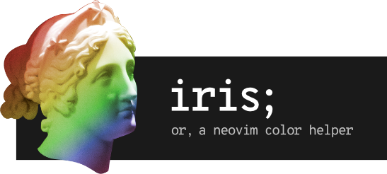

# Iris

<p align="center"></p>

Iris is a [Neovim] package that generates a normalized color palette based on your colorscheme. It is named for the goddess [Iris] of Greek mythology, personification of the rainbow.

## Table of Contents

- [Why?](#why)
- [Overview](#overview)
  - [Orthogonality](#orthogonality)
- [The Palette](#the-palette)
  - [Conjuring](#conjuring)
  - [Colors](#colors)
    - [Base Colors](#base-colors)
    - [Aliases](#aliases)
    - [Blends](#blends)
- [Usage](#usage)
- [Examples](#examples)
- [Contributing](#contributing)

## Why?

My development environment consists of three primary tools: Neovim, [tmux], and [kitty]. I like to try and keep the color settings of these tools synchronized against a single palette. This task, at the very least, means finding pre-built matching configuration files and more often means writing some of these files myself. This is a boring, error-prone process, which makes it a good candidate for automation. So here we are.

## Overview

Iris gives you access to a Lua table representing a color palette with a set of known keys each time a colorscheme is loaded.

By specifying a series of callback functions, you can leverage this palette to automatically update the colors of Neovim as well as external programs. For example, I have callbacks in place to:

* Customize certain Neovim highlight groups
* Set my [galaxyline] colors
* Set my tmux colors using the tmux CLI
* Set my kitty colors using kitty’s remote control facility


### Orthogonality

A tenet of the [lightline.vim] package which I admire is the concept of package orthogonality. lightline.vim describes it thusly:

> The plugin does not rely on the implementation of other plugins. Such plugin crossing settings should be configured by users.
 
Iris extends this to external tools and, as such, includes no built-in color-changing functionality. Such behavior is beyond the scope and intent of this package, and is left to the end user to implement.

## The Palette

An Iris palette is composed of a set of core colors based on the [base16] architecture as well as some convenient aliases and a few specialized colors.

### Conjuring

There are a few methods with an Iris palette is brought forth, listed here in order of precedence:

1. If you have created and specified a custom palette named the same as your colorscheme, Iris will use this data, filling in the gaps where necessary. A custom palette must define *at minimum* the sixteen core colors. You can see [my custom Tokyo Night palette] as an example.
2. If the [nvim-base16] package is available and you are using a `base16-*` colorscheme, Iris will use the base16 colors defined by the package.
3. In every other scenario, the palette is derived from existing Neovim highlight groups. This *usually* works pretty well and makes Iris a hands-off solution in most cases.

### Colors

An Iris palette contains a few groups of colors, described hereafter.

#### Base Colors

These are the core base16 colors, as defined by the [base16 spec].

#### Aliases

These are aliases for base colors that make the palette table easier to work with. Some examples:

* `green` maps to `base0B`
* `bg` maps to `base00`
* `warn` maps to `base0A`

#### Blends

These are derived by blending two colors together to varying degrees. For example, the `cursorline` color is `base07` blended with a bit of `base00`, making it just slightly brighter than the background.

Shout out to [folke]’s [Tokyo Night] colorscheme for the blending functions used in this package.

## Usage

The most basic Iris setup looks like:

```lua
require("iris").setup({})
```

This, however, isn’t terribly useful. Iris accepts a table of optional settings:

- `callbacks`: A list of functions, each accepting an Iris palette as an argument, that will be run each time Iris generates a new palette. This is where the action is.
- `palettes`: A list of tables defining custom palettes for matching colorschemes.
- `autocmd`: If set to `false`, Iris will *not* add an autocommand to regenerate the palette and run the callbacks on the `ColorScheme` event. This can be done manually by running `:lua require("iris").load()`.

The following setup will display the Iris palette each time it is generated and use a custom palette for the [Srcery] colorscheme:

```lua
require("iris").setup({
  callbacks = {
    function (pal) print(vim.inspect(pal) end, 
  },
  palettes = {
    srcery = require("my_srcery_palette"), 
  }
})
```

## Examples

- An [Iris callback](https://github.com/ngscheurich/dotfiles/blob/main/nvim/.config/nvim/lua/pkg/conf/iris/tmux.lua) and [shell script](https://github.com/ngscheurich/dotfiles/blob/main/bin/bin/tmux-theme) to keep tmux in sync with Neovim
- An [Iris callback](https://github.com/ngscheurich/dotfiles/blob/main/nvim/.config/nvim/lua/pkg/conf/iris/kitty.lua) to keep kitty in sync with Neovim
- Using Iris to [set some Neovim highlights](https://github.com/ngscheurich/dotfiles/blob/main/nvim/.config/nvim/lua/pkg/conf/iris/nvim.lua)

## Contributing

Pull requests and issues are welcome; please adhere to the [Code of Conduct].

[Neovim]: https://neovim.io/
[Iris]: https://en.wikipedia.org/wiki/Iris_(mythology)
[kitty]: https://sw.kovidgoyal.net/kitty/
[tmux]: https://github.com/tmux/tmux/wiki
[base16]: http://www.chriskempson.com/projects/base16/
[base16 spec]: http://www.chriskempson.com/projects/base16/#styling-guidelines
[folke]: https://github.com/folke
[Tokyo Night]: https://github.com/folke/tokyonight.nvim/
[nvim-base16]: https://github.com/RRethy/nvim-base16
[galaxyline]: https://github.com/glepnir/galaxyline.nvim
[Srcery]: https://github.com/srcery-colors/srcery-vim
[lightline.vim]: https://github.com/itchyny/lightline.vim
[tokyonight-palette]: https://github.com/ngscheurich/dotfiles/blob/main/nvim/.config/nvim/lua/pkg/conf/iris/tokyonight.lua
[Code of Conduct]: https://github.com/ngscheurich/iris.nvim/blob/main/CODE_OF_CONDUCT.md
